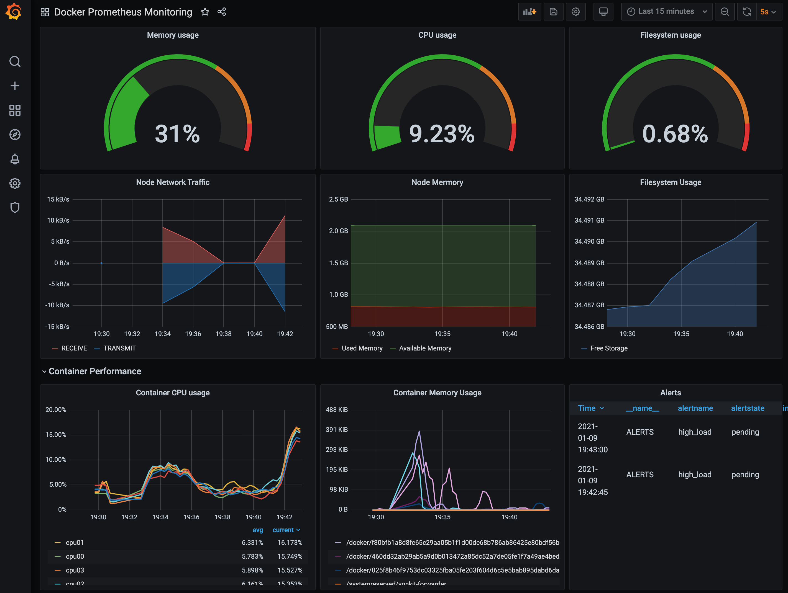
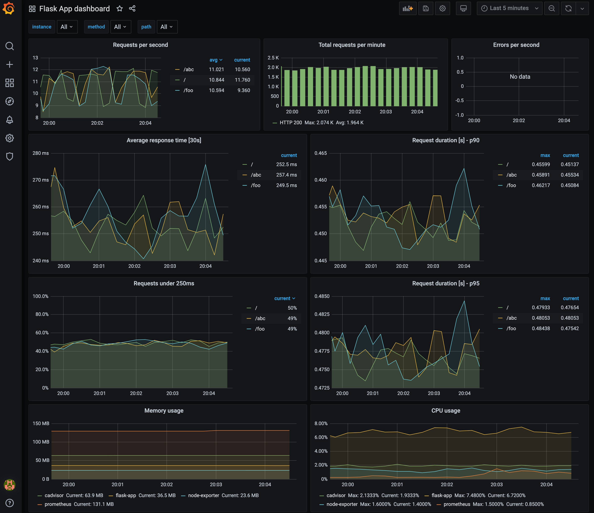
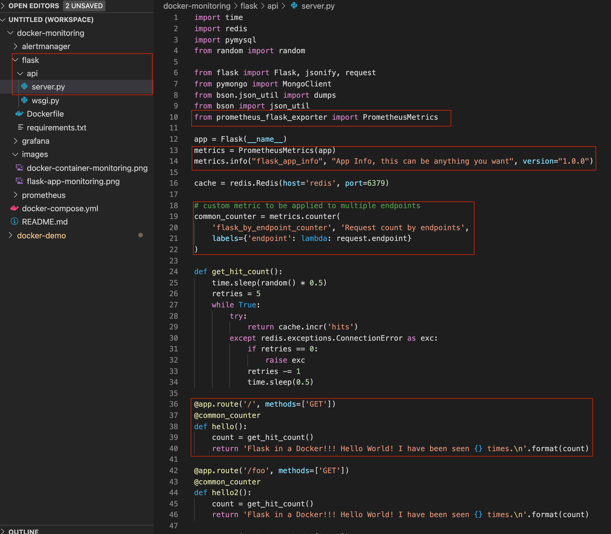

# Monitoring Servers and Docker Containers using Prometheus with Grafana

## 1. Introduction
Infrastructure monitoring is the basis for application performance management. The underlying system’s availability and health must be maximized continually. To achieve this, one has to monitor the system metrics like CPU, memory, network, and disk. Response time lag, if any must be addressed swiftly. Here we'll take a look at how to Monitor servers (and even Docker Containers running inside the Server) using Grafana, Prometheus, Node Exporter, CAdvisor and Flask App.

---

## 2. Core Components
- Grafana- Database for Analytics & monitoring solution
- Prometheus- Event monitoring and alerting
- Node-Exporter- Monitoring Linux host metrics
- CAdvisor- Monitoring metrics for the running Containers.
- Flask-App- Your Flask App (or Django, etc)

---

## 3. Running Docker Compose Up
```
$ docker-compose build
$ docker-compose up
```

---

## 4. Grafana UI
http://localhost:3001

Login with
id: admin
pw: 1234

### Docker container dashboard


### Flask application dashboard


---

## 5. Flask code

Metrics type: https://prometheus.io/docs/concepts/metric_types/

### requirements.txt
```
flask
redis
...
prometheus-flask-exporter
...
```

### Prometheus Flask exporter
This library provides HTTP request metrics to export into Prometheus. It can also track method invocations using convenient functions.

https://pypi.org/project/prometheus-flask-exporter/

### code:



## 6. How to configure a scrape on Prometheus


---

## 7. Load simulation with Apache Benchmark
Apache benchmark is a simple-to-use tool to help you understand how an HTTP server copes with large volumes of traffic. 

i.e) Fire 500 requests, with a maximum concurrency of 10 at a time
$ ab -c 10 —n 500 —r localhost:5000

```
$ ab -n 1000 -c 3 http://localhost:5000/
This is ApacheBench, Version 2.3 <$Revision: 1879490 $>
Copyright 1996 Adam Twiss, Zeus Technology Ltd, http://www.zeustech.net/
Licensed to The Apache Software Foundation, http://www.apache.org/

Benchmarking localhost (be patient)
Completed 100 requests
Completed 200 requests
Completed 300 requests
Completed 400 requests
Completed 500 requests
Completed 600 requests
Completed 700 requests
Completed 800 requests
Completed 900 requests
Completed 1000 requests
Finished 1000 requests


Server Software:        Werkzeug/1.0.1
Server Hostname:        localhost
Server Port:            5000

Document Path:          /
Document Length:        65 bytes

Concurrency Level:      3
Time taken for tests:   85.899 seconds
Complete requests:      1000
Failed requests:        0
Total transferred:      218000 bytes
HTML transferred:       65000 bytes
Requests per second:    11.64 [#/sec] (mean)
Time per request:       257.697 [ms] (mean)
Time per request:       85.899 [ms] (mean, across all concurrent requests)
Transfer rate:          2.48 [Kbytes/sec] received

Connection Times (ms)
              min  mean[+/-sd] median   max
Connect:        0    0   0.0      0       0
Processing:     4  257 143.3    259     504
Waiting:        4  257 143.3    258     504
Total:          4  257 143.3    259     504

Percentage of the requests served within a certain time (ms)
  50%    259
  66%    335
  75%    385
  80%    405
  90%    455
  95%    480
  98%    493
  99%    498
 100%    504 (longest request)

ab -n 1000000 -c 3 http://localhost:5000/abc

ab -n 1000000 -c 3 http://localhost:5000/foo
```

#### Note) alternative GUI tool: With JMeter
> JMeter is a more powerful tool than Apache Benchmark and allows you to be a bit more specific about 
> how your traffic is fired. For example, with JMeter it is possible to say “Send 1000 requests spaced > out over 1 minute”, which is much more realistic. It is so configurable that it provides a GUI 
> (Graphical User Interface) to help you set up your tests. https://jmeter.apache.org/

---

## 8. Folder structure
```
├── README.md
├── alertmanager
│   └── config.yml
├── docker-compose.yml
├── flask
│   ├── Dockerfile
│   ├── api
│   │   ├── server.py
│   │   └── wsgi.py
│   └── requirements.txt
├── grafana
│   ├── config.monitoring
│   └── provisioning
│       ├── dashboards
│       │   ├── Docker\ Prometheus\ Monitoring-1571332751387.json
│       │   ├── FlaskApp_Monitoring.json
│       │   └── dashboard.yml
│       └── datasources
│           └── datasource.yml
└── prometheus
    ├── alert.rules
    └── prometheus.yml

8 directories, 14 files
```

---

## Reference:
- Prometheus: https://prometheus.io
- Prometheus Flask Package: https://github.com/rycus86/prometheus_flask_exporter
- CAdvisor(System resource montoring): https://github.com/google/cadvisor
- Apache HTTP server benchmarking tool: https://httpd.apache.org/docs/2.4/programs/ab.html